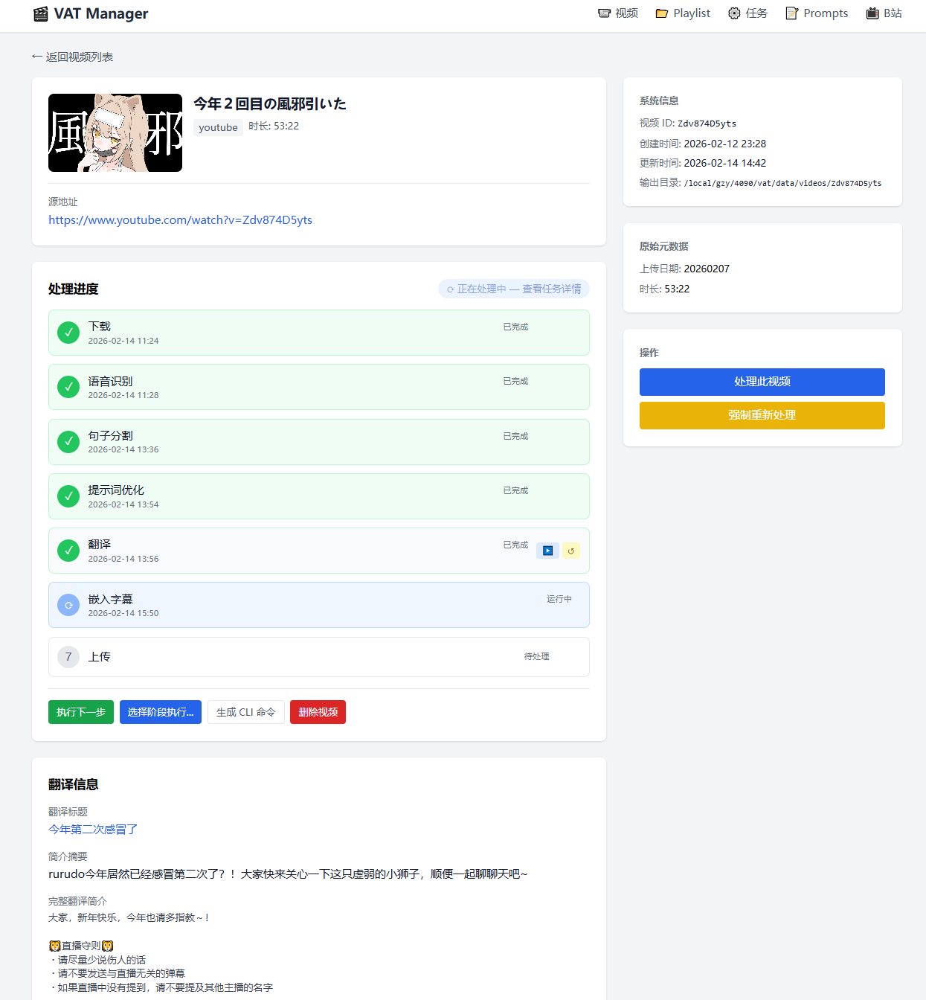
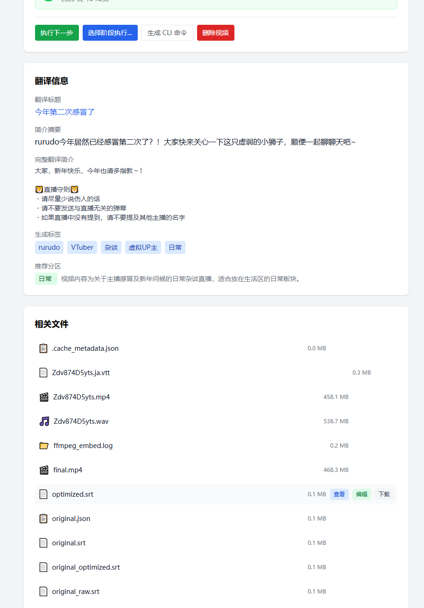
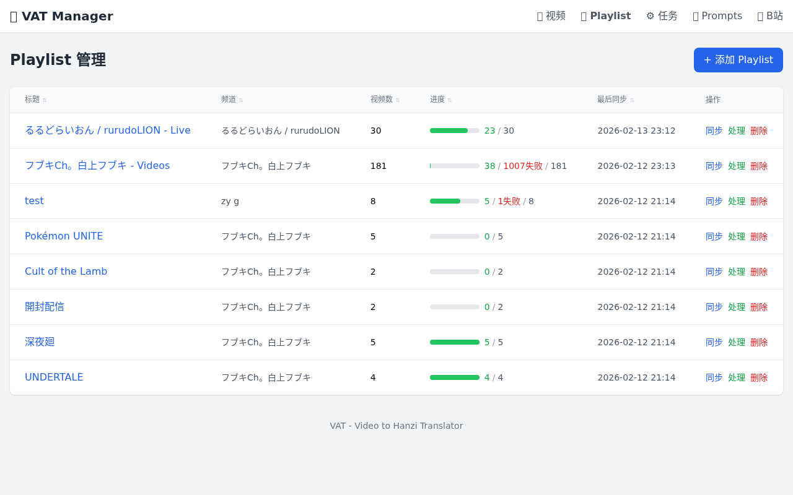
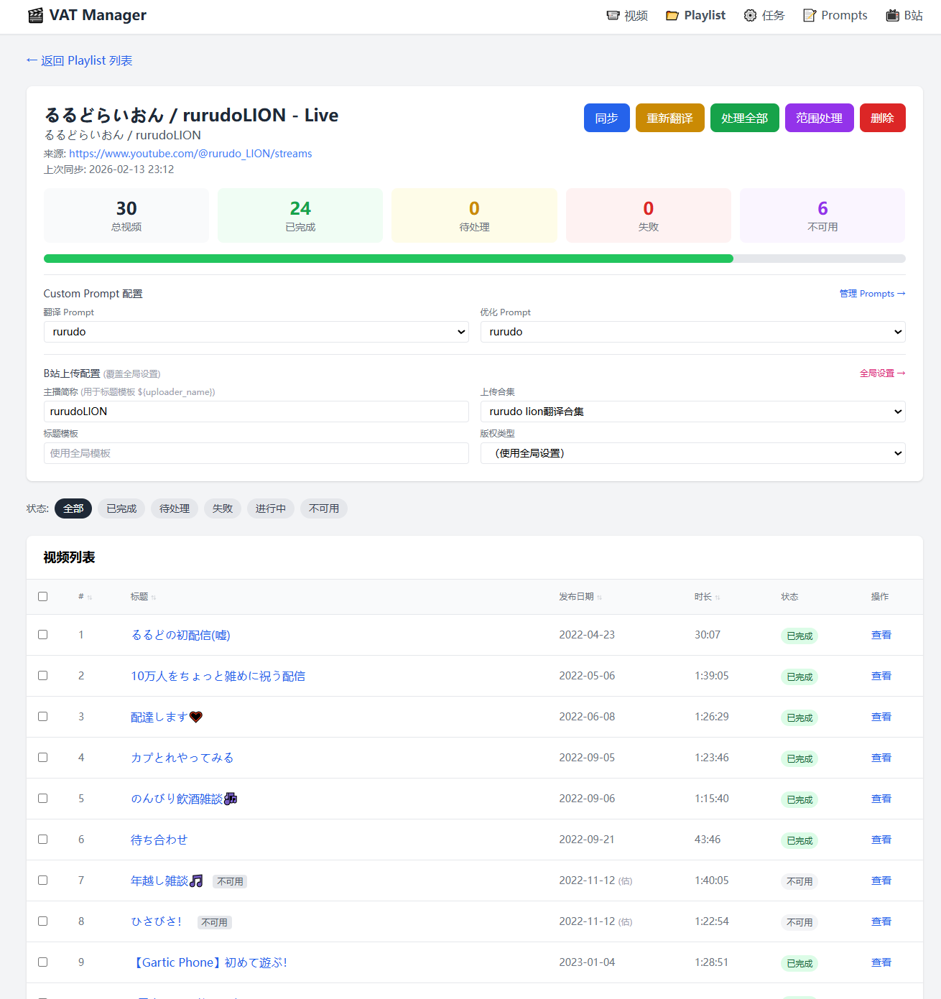
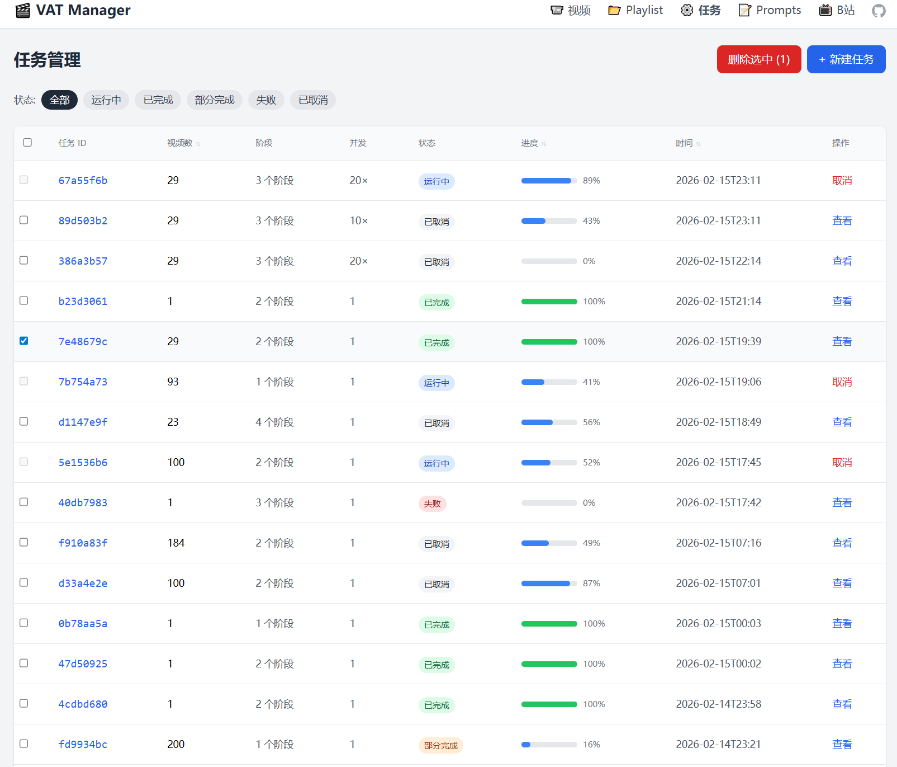

# VAT — Video Auto Translator

> **🇬🇧 [English Documentation](README_EN.md)**

端到端的视频翻译自动化流水线。从 YouTube 下载到语音识别、智能断句、LLM 翻译、字幕嵌入，直至上传 B 站，全流程自动完成。

支持 **命令行（CLI）** 和 **Web 管理界面** 两种使用方式。CLI 是核心能力载体，WebUI 是增强管理层——类似 Clash 与其 Dashboard 的关系：所有处理能力完全不依赖 WebUI，WebUI 仅提供可视化操作的便利。

<p align="center">
  
</p>

---

## 目录

- [开发与运行环境](#开发与运行环境)
- [定位与特点](#定位与特点)
- [处理流水线](#处理流水线)
- [各阶段能力](#各阶段能力)
- [快速开始](#快速开始)
- [CLI 使用](#cli-使用)
- [Web 管理界面](#web-管理界面)
- [项目结构](#项目结构)
- [配置进阶](#配置进阶)
- [技术文档](#技术文档)
- [致谢](#致谢)
- [许可证](#许可证)

---

## 开发与运行环境

> ⚠️ VAT 主要在 **Linux 多 GPU 服务器**（Ubuntu 22.04, CUDA 12.x, 多张 RTX 4090）上开发和测试。
>
> 如果你在 **Windows 家用电脑**上运行，可能遇到以下问题：
> - CUDA / FFmpeg / yt-dlp 的路径和环境变量差异
> - 多 GPU 调度相关功能未在 Windows 上测试
> - 部分依赖（如 faster-whisper）在 Windows 上的安装可能需要额外步骤
>
> 欢迎反馈 Windows 环境下的兼容性问题。

---

## 定位与特点

VAT 的设计目标是**服务器端批量视频翻译**，而非面向单个视频的桌面工具。

### 架构定位

- **CLI 是核心**：所有处理能力通过 `vat` 命令行暴露，可脚本化、可集成到其他系统
- **WebUI 是增强**：WebUI 通过调用 CLI 子进程执行任务，不引入额外依赖。即使 WebUI 不启动，系统能力不受任何影响；WebUI 提供的是视频信息浏览、批量选择、进度可视化等便利
- **流水线可拆分**：7 个阶段独立可控，可以只跑其中几步、跳过已完成的、或强制重跑某一步。中断后从断点继续
- **可集成**：pipeline 模块可以直接被其他 Python 项目导入使用，不绑定任何 UI 框架

### 相对于单视频工具的差异

- **批量管理**：支持 Playlist 级别的增量同步、按时间排序、批量处理，管理数千个视频
- **阶段级追踪**：每个视频的每个处理阶段独立记录状态，支持断点续传和选择性重跑
- **并发调度**：多 GPU 任务调度、多视频并行处理
- **状态可恢复**：进程崩溃后自动检测孤儿任务，重启即可继续

---

## 处理流水线

```
YouTube URL / 本地视频
    │
    ├─ 1. Download ─── 下载视频 + 字幕 + 元数据 + 场景识别 + 视频信息翻译
    ├─ 2. Whisper ──── faster-whisper 语音识别（支持分块并发、人声分离）
    ├─ 3. Split ────── LLM 智能断句（零碎片段→完整句子，时间戳对齐）
    ├─ 4. Optimize ─── LLM 字幕优化（纠错、术语统一）
    ├─ 5. Translate ── LLM 反思翻译（初译→反思→重译）
    ├─ 6. Embed ────── 字幕嵌入视频（硬字幕 GPU 加速 / 软字幕）
    └─ 7. Upload ───── 自动上传 B 站（标题模板、封面、分区推荐）
```

---

## 各阶段能力

### 语音识别（ASR）

基于 [faster-whisper](https://github.com/guillaumekln/faster-whisper)，在实际使用中对参数做了较广泛的测试（参见 [ASR 评估报告](docs/ASR_EVALUATION_REPORT.md)），采用了针对日语口语场景（VTuber 直播、游戏实况等）调优后的配置。

- **分块并发**：长视频自动切分为多段并行转录，合并时处理重叠区域
- 词级时间戳，为后续断句提供精确定位
- **ASR 后处理**：幻觉检测（移除重复片段、无意义的固定短语等）、日语标点标准化。后处理实现参考了 [WhisperJAV](https://github.com/meizhong986/WhisperJAV.git) 项目
- **人声分离**（可选，默认未启用）：基于 [Mel-Band-Roformer](https://github.com/KimberleyJensen/Mel-Band-Roformer-Vocal-Model) 模型，用于处理有背景音乐的视频

### 智能断句

Whisper 输出的片段通常零碎且不完整。本阶段使用 LLM 将这些片段重组为符合人类阅读习惯的完整句子。

断句的基本思路借鉴自 [VideoCaptioner](https://github.com/WEIFENG2333/VideoCaptioner) 项目，但在时间戳对齐算法上做了较大改动——原实现在长视频上容易出现时间漂移和句子时间不对齐的问题，当前版本在对齐精度上有明显改善。

- 支持分块断句（长视频）和全文断句（短视频）
- 可配置的句子长度约束（CJK / 英文分别控制）
- 场景感知：不同类型的视频（游戏、闲聊、歌曲等）使用不同的断句策略

### 字幕优化与翻译

翻译引擎的核心实现来自 [VideoCaptioner](https://github.com/WEIFENG2333/VideoCaptioner) 项目（其翻译引擎基于 [GalTransl](https://github.com/xd2333/GalTransl)），包括：

- **反思翻译**（基于吴恩达方法论）：初译 → 反思 → 重译，显著提升翻译质量
- **字幕优化**：翻译前自动修正原文中的错别字、统一术语
- **场景提示词**：根据视频类型（游戏、科普、闲聊等）自动加载专用提示词
- **自定义提示词**：支持为特定频道或内容定制翻译/优化提示词

VAT 在此基础上的改动：
- **上下文关联处理**：批量翻译时支持分 chunk 顺序执行并维护前文上下文（而非纯并行），以保持术语和风格一致性
- 更灵活的模型配置

> **关于本地模型**：配置中支持填写本地 LLM 地址（如 Ollama），但目前未做专门适配和测试，实际效果未验证。如果需要在本项目中自动唤起本地服务（类似 GalTransl），尚未实现。主要是因为 gpt-4o-mini 的能力已经不足了，gpt-5-nano 才勉强可用——本地模型达到这个性能目前仍很困难

### 字幕嵌入

- **硬字幕**：GPU 加速（H.264/H.265/AV1），封装了 FFmpeg 的 NVIDIA 硬件编码调用
- **软字幕**：快速封装，保持原画质
- 内置多套 ASS 字幕样式模板（默认、科普风、番剧风、竖屏等），并根据视频分辨率自动缩放

### 视频下载

基于 [yt-dlp](https://github.com/yt-dlp/yt-dlp)：

- 支持 YouTube 视频和播放列表
- 自动下载人工字幕（检测到人工字幕时可跳过 ASR）
- **Playlist 增量同步**：按时间顺序管理视频，支持后续只同步新增视频
- LLM 场景自动识别（游戏、闲聊、歌曲、科普等）
- LLM 视频信息自动翻译（标题、简介、标签）

### B 站上传

基于 [biliup](https://github.com/biliup/biliup)：

- 模板系统：标题/简介支持变量替换（频道名、翻译标题等）
- 自动获取封面、生成标签
- LLM 推荐 B 站分区
- 支持添加到合集（⚠️ 已知问题：视频可以上传成功，但添加合集的功能目前不稳定，有时会失败）
- 定时上传：支持 cron 表达式指定上传时间，每次触发上传一个视频（CLI `--upload-cron` / WebUI 可视化配置）

### 调度与并发

- 多 GPU 任务调度：自动检测显卡，分配视频到不同 GPU
- 步骤级状态追踪：每个阶段独立记录状态，支持断点续传
- 配置快照缓存：修改断句参数只重跑断句，不重跑 ASR
- 多视频并行处理（可配置并发数）

---

## 快速开始

### 环境要求

- Python 3.10+
- CUDA GPU（推荐，ASR 和硬字幕嵌入需要）
- ffmpeg（系统级安装）
- LLM API（断句、翻译、优化需要；支持任何 OpenAI 格式 API）

### 安装

```bash
git clone <repo-url> && cd vat
pip install -r requirements.txt
pip install -e .
```

> **关于 `vat` 命令与 `python -m vat`**：安装后可直接使用 `vat` 命令。如果 `vat` 命令不可用（PATH 问题或开发模式迭代频繁），可用 `python -m vat` 替代，两者等价。本文档示例以 `vat` 为主，均可替换为 `python -m vat`。

**字体文件**（备用）：

将字体放入 `vat/resources/fonts/` 目录。大部分 Ubuntu 系统已自带我们默认样式使用的 NotoSansCJK，通常无需手动安装。

| 字体 | 用途 | 来源 |
|------|------|------|
| NotoSansCJKsc-VF.ttf | 默认中日韩字体 | [Google Fonts](https://fonts.google.com/noto/specimen/Noto+Sans+SC) |
| LXGWWenKai-Regular.ttf | 番剧风格（可选） | [LXGW WenKai](https://github.com/lxgw/LxgwWenKai) |
| ZCOOLKuaiLe-Regular.ttf | 科普风格（可选） | [Google Fonts](https://fonts.google.com/specimen/ZCOOL+KuaiLe) |
| AlimamaFangYuanTiVF-Thin-2.ttf | 竖屏风格（可选） | [Alimama Fonts](https://fonts.alibabagroup.com/) |

### 配置

```bash
# 设置 LLM API Key（环境变量）
export VAT_LLM_APIKEY="your-api-key"

# 生成配置文件
vat init

# 编辑配置（路径、模型、翻译参数等）
nano config/config.yaml
```

关键配置项：

| 配置项 | 说明 |
|--------|------|
| `storage.work_dir` | 工作目录（处理中间文件） |
| `storage.output_dir` | 输出目录（最终视频） |
| `storage.models_dir` | 模型文件目录 |
| `asr.model` | Whisper 模型（推荐 `large-v3`） |
| `asr.language` | 源语言（如 `ja`） |
| `llm.api_key` | 全局 LLM API Key（支持 `${ENV_VAR}` 引用环境变量） |
| `llm.base_url` | 全局 LLM API 地址 |
| `translator.llm.model` | 翻译使用的 LLM 模型 |
| `translator.llm.enable_reflect` | 是否启用反思翻译 |

各阶段（断句、翻译、优化）支持独立覆写 `api_key` / `base_url` / `model`，留空则继承全局配置。完整说明参见 [`config/default.yaml`](config/default.yaml) 中的注释。

---

## CLI 使用

### 一键处理

```bash
# 处理单个视频（全流程：下载→识别→断句→优化→翻译→嵌入）
vat pipeline --url "https://www.youtube.com/watch?v=VIDEO_ID"
# 或等价地：python -m vat pipeline --url "..."

# 处理播放列表
vat pipeline --playlist "https://www.youtube.com/playlist?list=PLAYLIST_ID"

# 多 GPU 并行
vat pipeline --url "URL" --gpus 0,1
```

### 分阶段执行

```bash
# 方式一：指定阶段列表（逗号分隔）
vat process -v VIDEO_ID -s download,whisper,split

# 方式二：指定单个阶段
vat process -v VIDEO_ID -s translate

# 方式三：使用快捷命令
vat download -u URL              # 仅下载
vat asr -v VIDEO_ID              # 仅语音识别
vat translate -v VIDEO_ID        # 仅翻译
vat embed -v VIDEO_ID            # 仅嵌入字幕

# 强制重跑（忽略已完成状态）
vat process -v VIDEO_ID -s translate -f

# 指定 GPU
vat process -v VIDEO_ID -s whisper -g cuda:1

# 多视频并行
vat process -v VID1 -v VID2 -v VID3 -s download,whisper -c 3
```

> **阶段跳跃**：如果指定了不连续的阶段（如 `whisper,embed` 以测试日语原文嵌入效果），系统会自动填充中间阶段并以“直通模式”执行（复制输入到输出），直通阶段标记为 `SKIPPED`。

### Playlist 管理

```bash
# 同步播放列表
vat playlist sync "https://www.youtube.com/playlist?list=PLAYLIST_ID"

# 查看处理状态
vat status
```

### 命令速查

| 命令 | 说明 |
|------|------|
| `vat pipeline -u URL` | 完整流水线（下载到嵌入） |
| `vat process -v ID -s STAGES` | 细粒度阶段控制 |
| `vat download -u URL` | 仅下载 |
| `vat asr -v ID` | 仅语音识别 |
| `vat translate -v ID` | 仅翻译 |
| `vat embed -v ID` | 仅嵌入字幕 |
| `vat upload VIDEO_ID` | 上传到 B 站 |
| `vat process -v ID -s upload --upload-cron "0 12,18 * * *"` | 定时上传（每天 12/18 点） |
| `vat playlist sync URL` | 同步播放列表 |
| `vat status` | 查看处理状态 |
| `vat clean -v ID` | 清理中间产物 |
| `vat bilibili login` | B 站登录获取 Cookie |

### 输出文件

```
data/videos/<VIDEO_ID>/
├── <video>.mp4           # 原始下载视频
├── original_raw.srt      # Whisper 原始转录
├── original.srt          # 断句后的原文字幕
├── optimized.srt         # 优化后的原文字幕
├── translated.srt        # 翻译后的字幕
├── translated.ass        # ASS 格式字幕（带样式）
└── final.mp4             # 嵌入字幕的最终视频
```

---

## Web 管理界面

WebUI 是对 CLI 能力的可视化封装。所有任务通过子进程调用 CLI 执行，与 Web 服务器生命周期完全解耦——Web 服务重启不影响正在运行的任务。

```bash
# 启动（默认端口 8094）
vat web
# 或指定端口
vat web --port 8080
```

### 视频管理

视频列表页提供全局总览：状态统计、搜索筛选（按标题/频道/状态/阶段/Playlist）、分页浏览。每个视频显示缩略图、来源、时长、7 阶段状态、进度、发布日期。

<p align="center">
  
</p>

视频详情页展示完整的处理时间线、翻译信息、相关文件（支持在线查看、编辑字幕、播放视频）。可直接点击执行某个阶段或强制重做。

<p align="center">
  
</p>
<p align="center">
  
</p>

### Playlist 管理

支持添加 YouTube Playlist 并增量同步。视频按发布日期排序，支持批量处理、范围选择。每个 Playlist 可独立配置翻译/优化提示词和 B 站上传参数。

<p align="center">
  
</p>

<p align="center">
  
</p>

### 任务管理

创建任务时可选择视频、执行阶段、GPU 设备、并发数。任务执行中提供实时日志（SSE 推送）和进度追踪。支持取消、重试、批量删除。

<p align="center">
  
</p>

<p align="center">
  
</p>

详细操作说明参见 [WebUI 使用手册](docs/webui_manual.md)。

---

## 项目结构

```
vat/
├── asr/                  # 语音识别模块
│   ├── whisper_asr.py    #   faster-whisper 封装
│   ├── chunked_asr.py    #   分块并发 ASR
│   ├── split.py          #   LLM 智能断句
│   ├── asr_post.py       #   后处理（幻觉/重复检测）
│   └── vocal_separation/ #   人声分离
├── translator/           # 翻译模块
│   └── llm_translator.py #   LLM 反思翻译引擎
├── llm/                  # LLM 基础设施
│   ├── client.py         #   统一 LLM 调用客户端
│   ├── scene_identifier.py # 场景识别
│   └── prompts/          #   提示词管理（内置 + 自定义）
├── embedder/             # 字幕嵌入模块
│   └── ffmpeg_wrapper.py #   FFmpeg 封装（软/硬字幕 + GPU 加速）
├── downloaders/          # 下载器（yt-dlp）
├── uploaders/            # 上传器（B 站 biliup）
├── pipeline/             # 流水线编排
│   ├── executor.py       #   VideoProcessor（阶段调度）
│   ├── scheduler.py      #   多 GPU 调度器
│   └── progress.py       #   进度追踪
├── web/                  # Web 管理界面
│   ├── app.py            #   FastAPI 应用 + 页面路由
│   ├── jobs.py           #   任务管理器（子进程调度）
│   ├── routes/           #   API 路由
│   └── templates/        #   Jinja2 + TailwindCSS 页面模板
├── cli/                  # CLI 命令（click）
├── services/             # 业务逻辑层（Playlist 服务等）
├── database.py           # SQLite 数据层（WAL 模式）
├── config.py             # 配置管理（YAML + 环境变量）
└── models.py             # 数据模型定义
```

其中每个模块文件夹内均有各自的文档说明

---

## 配置进阶

### 自定义提示词

在 `vat/llm/prompts/custom/` 下创建提示词文件，在配置中引用文件名：

```yaml
translator:
  llm:
    custom_prompt: "my_channel"          # 翻译提示词
    optimize:
      custom_prompt: "my_channel"        # 优化提示词
```

也可通过 WebUI 的 Prompts 管理页面创建和编辑。提示词编写指南参见 [提示词优化指南](docs/prompt_optimization_guide.md)。

### 场景识别

VAT 根据视频标题和简介自动识别场景类型（游戏、闲聊、歌曲、科普等），并加载对应的场景提示词。场景配置定义在 `vat/llm/scenes.yaml` 中。

### ASR 参数调优

不同类型的视频可能需要不同的 ASR 参数：

- 游戏/直播：关闭 VAD，降低 `no_speech_threshold`
- 纯人声（播客）：开启 VAD
- 背景音乐重的视频：考虑启用人声分离

参数详解参见 [ASR 参数指南](docs/asr_parameters_guide.md)。

### GPU 分配

多 GPU 环境下的任务分配策略说明参见 [GPU 分配规范](docs/gpu_allocation_spec.md)。

---

## 技术文档

| 文档 | 内容 |
|------|------|
| [ASR 参数指南](docs/asr_parameters_guide.md) | Whisper 参数详解与调优建议 |
| [ASR 评估报告](docs/ASR_EVALUATION_REPORT.md) | 350 个 VTuber 视频的参数评估实验 |
| [提示词优化指南](docs/prompt_optimization_guide.md) | 翻译/优化提示词的编写方法 |
| [GPU 分配规范](docs/gpu_allocation_spec.md) | 多 GPU 调度策略 |
| [WebUI 手册](docs/webui_manual.md) | Web 界面功能详解与操作说明 |
| [YouTube 字幕](docs/youtube_manual_subtitles.md) | YouTube 人工字幕检测与使用 |
| [字幕样式指南](docs/subtitle_style_guide.md) | ASS 字幕样式模板说明 |
| [已知问题](docs/known_issues.md) | 已知限制与 LLM 成本参考 |

---

## 致谢

本项目集成了以下开源项目的内容，或进行了二次封装调用：

- [VideoCaptioner](https://github.com/WEIFENG2333/VideoCaptioner) — 分块 ASR、智能断句、反思翻译、ASS 渲染的核心参考。VAT 的断句和翻译模块在此基础上做了修改和扩展
- [GalTransl](https://github.com/xd2333/GalTransl) — 想法来源
- [faster-whisper](https://github.com/guillaumekln/faster-whisper) — 语音识别
- [yt-dlp](https://github.com/yt-dlp/yt-dlp) — 视频下载
- [biliup](https://github.com/biliup/biliup) — B 站上传
- [Mel-Band-Roformer](https://github.com/KimberleyJensen/Mel-Band-Roformer-Vocal-Model) — 人声分离模型
- [WhisperJAV](https://github.com/meizhong986/WhisperJAV.git) — ASR 后处理参考（幻觉检测、重复清理）

详细致谢信息参见 [acknowledgement.md](docs/acknowledgement.md)。

---

## 支持

如果觉得项目有用，欢迎请我喝杯咖啡：

<p align="center">
  
</p>

---

## 许可证

GPLv3
